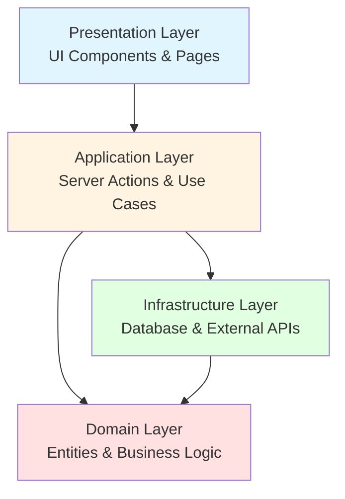

# Architecture Rules

## Architecture Principles

### Domain Driven Design (DDD)

- The project follows DDD principles.
- Core business logic should reside in the domain layer.
- Use ubiquitous language throughout the codebase.
- Entities and Value Objects model the domain.

### Layered Architecture

The application is structured into distinct layers with clear separation of concerns:

#### Layer Responsibilities

| 層                 | ディレクトリ                | 責務                                                                 | 例                                               |
| ------------------ | --------------------------- | -------------------------------------------------------------------- | ------------------------------------------------ |
| **Presentation**   | `src/app`, `src/components` | UIコンポーネント、ページ、ユーザーインタラクション                   | React components, Next.js pages                  |
| **Application**    | `src/application/actions`   | ユースケース、Server Actions、アプリケーションロジック               | createReservationAction, updateUserProfileAction |
| **Domain**         | `src/domain/models`         | エンティティ、バリューオブジェクト、ドメインサービス、ビジネスルール | User, Equipment, Reservation entities            |
| **Infrastructure** | `src/infrastructure`        | データベースアクセス、外部API、実装詳細                              | DrizzleUserRepository, database schema           |

#### Layer Dependencies

- **Presentation Layer** depends on **Application Layer**
- **Application Layer** depends on **Domain Layer** and **Infrastructure Layer**
- **Infrastructure Layer** depends on **Domain Layer** (for interfaces)
- **Domain Layer** has NO dependencies on other layers (pure business logic)

### Dependency Inversion Principle (DIP)

- High-level modules should not depend on low-level modules. Both should depend on abstractions.
- Interfaces should be defined in the Domain or Application layers, and implemented in the Infrastructure layer.
- Example: `IEquipmentRepository` interface is defined in Domain layer, `DrizzleEquipmentRepository` implements it in Infrastructure layer.

### Repository Pattern

- All data access goes through repository interfaces defined in the Domain layer.
- Repositories return `Result` types for type-safe error handling.
- Infrastructure layer provides concrete implementations using Drizzle ORM.

## Container Runtime

- **Podman** MUST be used instead of Docker for container management.
- All container-related commands should use `podman` or `podman compose`.
- Do NOT use `docker` commands.

## Database

- Database services are defined in `compose.yml`.
- Use the provided npm scripts for database management:
  - `npm run db:up` - Start database with Podman
  - `npm run db:down` - Stop database
  - `npm run db:push` - Push schema changes to database
  - `npm run db:seed` - Seed database with initial data
