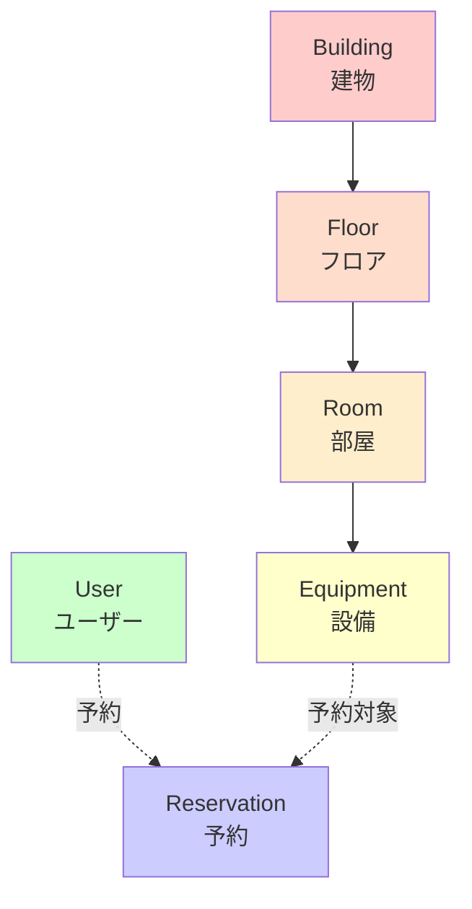
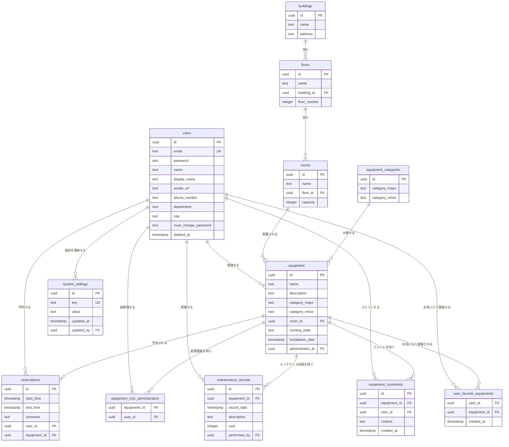

# プロジェクト概要

## 目的

設備予約システム - カレンダーベースの設備予約管理システム

本システムは、組織内の設備（機器）を効率的に予約・管理するためのWebアプリケーションです。建物→フロア→部屋→設備という階層構造で設備を管理し、カレンダーUIを通じて直感的に予約を行うことができます。

## 技術スタック

### フレームワーク・ライブラリ

| 技術             | バージョン | 用途                                                     |
| ---------------- | ---------- | -------------------------------------------------------- |
| **Next.js**      | 16.0.3     | フロントエンド・バックエンドフレームワーク（App Router） |
| **React**        | 19.2.0     | UIライブラリ                                             |
| **TypeScript**   | 5.x        | 型安全な開発言語                                         |
| **Tailwind CSS** | 4.x        | スタイリング                                             |
| **Shadcn/ui**    | -          | UIコンポーネントライブラリ                               |

### データベース・ORM

| 技術            | バージョン | 用途                               |
| --------------- | ---------- | ---------------------------------- |
| **PostgreSQL**  | -          | リレーショナルデータベース         |
| **Drizzle ORM** | 0.44.7     | TypeScript ORM                     |
| **Podman**      | -          | コンテナランタイム（Dockerの代替） |

### 認証・バリデーション

| 技術           | バージョン    | 用途                             |
| -------------- | ------------- | -------------------------------- |
| **Auth.js**    | 5.0.0-beta.30 | 認証（JWT戦略）                  |
| **Zod**        | 4.1.12        | スキーマバリデーション           |
| **neverthrow** | 8.2.0         | Result型によるエラーハンドリング |

### その他

| 技術                   | バージョン | 用途                 |
| ---------------------- | ---------- | -------------------- |
| **react-big-calendar** | 1.19.4     | カレンダーUI         |
| **date-fns**           | 4.1.0      | 日付操作             |
| **Vitest**             | 4.0.10     | テストフレームワーク |

## アーキテクチャ

本プロジェクトは**Domain Driven Design (DDD)**と**レイヤードアーキテクチャ**に基づいて構築されています。

詳細は **[ARCHITECTURE.md](./ARCHITECTURE.md)** を参照してください。

### レイヤー構成

- **Presentation Layer** (`src/app`, `src/components`) - UIコンポーネント、ページ
- **Application Layer** (`src/application/actions`) - Server Actions、ユースケース
- **Domain Layer** (`src/domain/models`) - エンティティ、ビジネスロジック
- **Infrastructure Layer** (`src/infrastructure`) - データベース、外部API

### 主要な設計原則

- **依存性逆転の原則 (DIP)**: インターフェースはDomain層で定義、Infrastructure層で実装
- **リポジトリパターン**: すべてのデータアクセスはリポジトリ経由
- **Result型**: `neverthrow`による型安全なエラーハンドリング

## 開発規約

詳細は **[CODING_RULES.md](./CODING_RULES.md)** を参照してください。

### 重要な原則

- **関数型プログラミング**: クラスの使用を避け、関数とデータ構造を優先
- **Test Driven Development (TDD)**: Classical School (Detroit School) アプローチ
- **Result型エラーハンドリング**: `neverthrow`の使用
- **Zodバリデーション**: すべての入力をバリデーション
- **Podman**: Dockerではなく Podman を使用

## ドメインモデル

### エンティティ階層構造

本システムは以下の階層構造でデータを管理します：



### 主要エンティティ

#### 1. **User（ユーザー）**

ファイル: [`src/domain/models/User/User.ts`](../src/domain/models/User/User.ts)

```typescript
type User = {
  readonly id: UserId; // UUID
  readonly email: UserEmail; // メールアドレス（ログインID）
  readonly name: string | null; // 名前
  readonly displayName: string | null; // 表示名
  readonly avatarUrl: string | null; // アバター画像URL
  readonly phoneNumber: string | null; // 電話番号
  readonly department: string | null; // 部署
  readonly role: UserRole; // 'GENERAL' | 'EDITOR' | 'ADMIN'
  readonly passwordHash: string; // パスワードハッシュ
};

type UserRole = "GENERAL" | "EDITOR" | "ADMIN";
```

**機能：**

- JWT認証によるログイン
- プロフィール編集（表示名、アバター、電話番号、部署）
- ロールベースのアクセス制御（GENERAL、EDITOR、ADMIN）
- 装置の管理者・副管理者としての権限
- ソフトデリート機能（論理削除）
- パスワード変更必須フラグ（初回ログイン時の強制パスワード変更）
- お気に入り装置の登録・管理

**データベーススキーマの追加フィールド：**

- `mustChangePassword`: パスワード変更必須フラグ（'true' または 'false' の文字列）
- `deletedAt`: ソフトデリートのタイムスタンプ（論理削除日時）

#### 2. **Building（建物）**

ファイル: [`src/domain/models/Building/Building.ts`](../src/domain/models/Building/Building.ts)

```typescript
type Building = {
  readonly id: BuildingId; // UUID
  readonly name: BuildingName; // 建物名（必須）
  readonly address: string | null; // 住所
};
```

#### 3. **Floor（フロア）**

ファイル: [`src/domain/models/Floor/Floor.ts`](../src/domain/models/Floor/Floor.ts)

```typescript
type Floor = {
  readonly id: FloorId; // UUID
  readonly name: FloorName; // フロア名（必須）
  readonly buildingId: BuildingId; // 所属建物ID
  readonly floorNumber: number | null; // 階数
};
```

#### 4. **Room（部屋）**

ファイル: [`src/domain/models/Room/Room.ts`](../src/domain/models/Room/Room.ts)

```typescript
type Room = {
  readonly id: RoomId; // UUID
  readonly name: RoomName; // 部屋名（必須）
  readonly floorId: FloorId; // 所属フロアID
  readonly capacity: number | null; // 収容人数
};
```

#### 5. **Equipment（設備）**

ファイル: [`src/domain/models/Equipment/Equipment.ts`](../src/domain/models/Equipment/Equipment.ts)

```typescript
type Equipment = {
  readonly id: EquipmentId; // UUID
  readonly name: EquipmentName; // 設備名（必須）
  readonly description: string | null; // 説明
  readonly categoryMajor: string | null; // 大分類
  readonly categoryMinor: string | null; // 小分類
  readonly roomId: RoomId | null; // 所属部屋ID
  readonly runningState: EquipmentRunningState; // 稼働状態
  readonly installationDate: Date | null; // 導入時期
  readonly administratorId: UserId | null; // 管理者ID
  readonly viceAdministratorIds: UserId[]; // 副管理者IDリスト
  // 表示用の拡張情報
  readonly administrator?: {
    id: UserId;
    name: string | null;
  };
  readonly viceAdministrators?: {
    id: UserId;
    name: string | null;
  }[];
  readonly location?: {
    buildingName: string;
    floorName: string;
    roomName: string;
  };
};

type EquipmentRunningState =
  | "OPERATIONAL"
  | "MAINTENANCE"
  | "OUT_OF_SERVICE"
  | "RETIRED";
```

**機能：**

- 稼働状態管理（稼働中、メンテナンス中、停止中、廃止）
- 導入時期の記録
- 管理者・副管理者の設定
- メンテナンス履歴の記録
- コメント機能

#### 6. **Reservation（予約）**

ファイル: [`src/domain/models/Reservation/Reservation.ts`](../src/domain/models/Reservation/Reservation.ts)

```typescript
type Reservation = {
  readonly id: ReservationId; // UUID
  readonly startTime: Date; // 開始時刻
  readonly endTime: Date; // 終了時刻
  readonly comment: string | null; // コメント
  readonly userId: UserId; // 予約者ID
  readonly equipmentId: EquipmentId; // 設備ID
  // 表示用の拡張情報
  readonly booker?: {
    id: UserId;
    name: string | null;
  };
  readonly equipment?: {
    id: EquipmentId;
    name: string;
  };
};
```

**ビジネスルール：**

- 開始時刻は終了時刻より前でなければならない
- 同一設備の同一時間帯に重複予約は不可
- 予約者本人のみが予約の編集・削除が可能

#### 7. **EquipmentCategory（設備カテゴリ）**

ファイル: [`src/domain/models/EquipmentCategory/EquipmentCategory.ts`](../src/domain/models/EquipmentCategory/EquipmentCategory.ts)

```typescript
type EquipmentCategory = {
  readonly id: EquipmentCategoryId; // UUID
  readonly categoryMajor: string; // 大分類（必須）
  readonly categoryMinor: string; // 小分類（必須）
};
```

#### 8. **SystemSettings（システム設定）**

ファイル: [`src/domain/models/SystemSettings/SystemSettings.ts`](../src/domain/models/SystemSettings/SystemSettings.ts)

```typescript
type SystemSetting = {
  id: string; // UUID
  key: string; // 設定キー
  value: string; // 設定値
  updatedAt: Date; // 更新日時
  updatedBy?: string | null; // 更新者ID
};
```

**機能：**

- システム全体の設定を管理
- タイムゾーン設定（`timezone` キー）
- 管理者のみが設定を変更可能

### ファクトリ関数とバリデーション

各エンティティは、Zodスキーマによるバリデーションを含むファクトリ関数で生成されます：

```typescript
// 例: Building
export const createBuilding = (
  id: string,
  name: string,
  address: string | null = null,
): Result<Building, BuildingError> => {
  const idResult = BuildingIdSchema.safeParse(id);
  if (!idResult.success) return err(new BuildingError("Invalid Building ID"));

  const nameResult = BuildingNameSchema.safeParse(name);
  if (!nameResult.success)
    return err(new BuildingError("Invalid Building Name"));

  return ok({
    id: idResult.data,
    name: nameResult.data,
    address,
  });
};
```

**特徴：**

- `neverthrow`の`Result`型による型安全なエラーハンドリング
- Zodスキーマによる実行時バリデーション
- イミュータブルなデータ構造

## データベーススキーマ

ファイル: [`src/infrastructure/database/schema.ts`](../src/infrastructure/database/schema.ts)

### テーブル構造



## リポジトリパターン

### インターフェース定義

各エンティティに対して、Domain層でリポジトリインターフェースを定義：

**例: `IEquipmentRepository`**

ファイル: [`src/domain/models/Equipment/IEquipmentRepository.ts`](../src/domain/models/Equipment/IEquipmentRepository.ts)

```typescript
export interface IEquipmentRepository {
  findAll(): Promise<Result<Equipment[], RepositoryError>>;
  findById(id: string): Promise<Result<Equipment | null, RepositoryError>>;
  findByRoomId(roomId: string): Promise<Result<Equipment[], RepositoryError>>;
  save(equipment: Equipment): Promise<Result<void, RepositoryError>>;
  delete(id: string): Promise<Result<void, RepositoryError>>;
}
```

### 実装

Infrastructure層でDrizzle ORMを使用した実装を提供：

**実装済みリポジトリ：**

| リポジトリ                           | ファイル                                                                                                                                                                                     | テスト |
| ------------------------------------ | -------------------------------------------------------------------------------------------------------------------------------------------------------------------------------------------- | ------ |
| `DrizzleBuildingRepository`          | [DrizzleBuildingRepository.ts](../src/infrastructure/repositories/DrizzleBuildingRepository.ts)                   | ✅     |
| `DrizzleFloorRepository`             | [DrizzleFloorRepository.ts](../src/infrastructure/repositories/DrizzleFloorRepository.ts)                         | ✅     |
| `DrizzleRoomRepository`              | [DrizzleRoomRepository.ts](../src/infrastructure/repositories/DrizzleRoomRepository.ts)                           | ✅     |
| `DrizzleEquipmentRepository`         | [DrizzleEquipmentRepository.ts](../src/infrastructure/repositories/DrizzleEquipmentRepository.ts)                 | ✅     |
| `DrizzleEquipmentCategoryRepository` | [DrizzleEquipmentCategoryRepository.ts](../src/infrastructure/repositories/DrizzleEquipmentCategoryRepository.ts) | ✅     |
| `DrizzleReservationRepository`       | [DrizzleReservationRepository.ts](../src/infrastructure/repositories/DrizzleReservationRepository.ts)             | ✅     |
| `DrizzleUserRepository`              | [DrizzleUserRepository.ts](../src/infrastructure/repositories/DrizzleUserRepository.ts)                           | ✅     |

**特徴：**

- すべてのリポジトリに対してユニットテストを実装済み
- Result型による型安全なエラーハンドリング
- Drizzle ORMによる型安全なクエリ

## アプリケーション層（Server Actions）

Next.js 16のServer Actionsを使用してアプリケーションロジックを実装：

### 主要なServer Actions

#### 認証関連

- ログイン・ログアウト処理
- セッション管理（JWT）

#### ユーザー管理

ファイル: [`src/application/actions/user.ts`](../src/application/actions/user.ts)

- `getCurrentUserAction` - 現在のユーザー情報取得
- `updateUserProfileAction` - プロフィール更新
- `getAllUsersAction` - 全ユーザー一覧取得（管理者用）
- `createUserAction` - ユーザー作成（管理者用）
- `updateUserRoleAction` - ユーザーロール更新（管理者用）
- `deleteUserAction` - ユーザー削除（ソフトデリート、管理者用）
- `changePasswordAction` - パスワード変更

#### 建物・フロア・部屋管理

ファイル: [`src/application/actions/building.ts`](../src/application/actions/building.ts), [`floor.ts`](../src/application/actions/floor.ts), [`room.ts`](../src/application/actions/room.ts)

- CRUD操作（作成、読み取り、更新、削除）
- 階層構造に基づく検索

#### 設備管理

ファイル: [`src/application/actions/equipment.ts`](../src/application/actions/equipment.ts)

- `createEquipmentAction` - 設備作成
- `updateEquipmentAction` - 設備更新
- `updateEquipmentManagementAction` - 管理者・副管理者の更新
- `deleteEquipmentAction` - 設備削除
- `getEquipmentByIdAction` - 設備詳細取得
- 部屋別設備一覧取得

ファイル: [`src/application/actions/maintenanceRecord.ts`](../src/application/actions/maintenanceRecord.ts)

- メンテナンス履歴のCRUD操作

ファイル: [`src/application/actions/equipmentComment.ts`](../src/application/actions/equipmentComment.ts)

- 装置コメントのCRUD操作

#### お気に入り管理

ファイル: [`src/application/actions/favorite.ts`](../src/application/actions/favorite.ts)

- `toggleFavoriteAction` - お気に入り装置の追加・削除
- `getFavoritesAction` - ユーザーのお気に入り装置一覧取得

#### システム設定管理

ファイル: [`src/application/actions/settings.ts`](../src/application/actions/settings.ts)

- `getTimezoneAction` - タイムゾーン設定取得
- `updateTimezoneAction` - タイムゾーン設定更新（管理者用）

#### ダッシュボード

ファイル: [`src/application/actions/dashboard.ts`](../src/application/actions/dashboard.ts)

- `getDashboardStatsAction` - ダッシュボード統計情報取得（建物数、装置数、アクティブ予約数、最近の予約、お気に入り装置、最近使用した装置）

#### 予約管理

ファイル: [`src/application/actions/reservation.ts`](../src/application/actions/reservation.ts)

- `createReservationAction` - 予約作成（重複チェック含む）
- `updateReservationAction` - 予約更新（権限チェック含む）
- `deleteReservationAction` - 予約削除（権限チェック含む）
- `getReservations` - 予約一覧取得
- `getReservationById` - 予約詳細取得

**特徴：**

- Zodスキーマによる入力バリデーション
- 認証・認可チェック
- ビジネスルールの検証（予約の重複チェックなど）
- `revalidatePath`による自動キャッシュ更新

## プレゼンテーション層（UI）

### ページ構成

```
/                          - ランディングページ
/login                     - ログインページ
/dashboard                 - ダッシュボード（統計、お気に入り、最近の予約）
/reservations              - 予約管理（カレンダー、装置フィルタリング）
/equipments                - 設備一覧
/equipments/[id]           - 設備詳細（稼働状態、管理者、メンテナンス履歴、コメント）
/buildings                 - 建物一覧
/buildings/[id]            - 建物詳細（フロア一覧）
/buildings/[id]/floors/[floorId]           - フロア詳細（部屋一覧）
/buildings/[id]/floors/[floorId]/rooms/[roomId]  - 部屋詳細（設備一覧）
/categories                - カテゴリ管理
/profile                   - ユーザープロフィール
/change-password           - パスワード変更
/users                     - ユーザー管理（管理者専用）
/settings                  - システム設定（管理者専用）
```

### 主要コンポーネント

#### 管理系コンポーネント

| コンポーネント       | ファイル                                                                                                                                                  | 機能               |
| -------------------- | --------------------------------------------------------------------------------------------------------------------------------------------------------- | ------------------ |
| `BuildingManager`    | [BuildingManager.tsx](../src/components/building/BuildingManager.tsx)          | 建物のCRUD操作UI       |
| `FloorManager`       | [FloorManager.tsx](../src/components/floor/FloorManager.tsx)                   | フロアのCRUD操作UI     |
| `RoomManager`        | [RoomManager.tsx](../src/components/room/RoomManager.tsx)                      | 部屋のCRUD操作UI       |
| `EquipmentManager`   | [EquipmentManager.tsx](../src/components/equipment/EquipmentManager.tsx)       | 設備のCRUD操作UI       |
| `CategoryManager`    | [CategoryManager.tsx](../src/components/equipment/CategoryManager.tsx)          | カテゴリのCRUD操作UI   |
| `ReservationManager` | [ReservationManager.tsx](../src/components/reservation/ReservationManager.tsx) | 予約のCRUD操作UI       |
| `UserProfileManager` | [UserProfileManager.tsx](../src/components/user/UserProfileManager.tsx)        | プロフィール編集UI     |
| `UserManager`        | [UserManager.tsx](../src/components/user/UserManager.tsx)                      | ユーザー管理UI（管理者用） |

#### カレンダーコンポーネント

| コンポーネント      | ファイル                                                                                                                                             | 機能                                       |
| ------------------- | ---------------------------------------------------------------------------------------------------------------------------------------------------- | ------------------------------------------ |
| `EquipmentCalendar` | [EquipmentCalendar.tsx](../src/components/calendar/EquipmentCalendar.tsx) | react-big-calendarを使用した予約カレンダー |

#### ナビゲーション

| コンポーネント | ファイル                                                                                                                        | 機能                                 |
| -------------- | ------------------------------------------------------------------------------------------------------------------------------- | ------------------------------------ |
| `Breadcrumbs`  | [Breadcrumbs.tsx](../src/components/Breadcrumbs.tsx) | パンくずリスト（階層ナビゲーション） |

**特徴：**

- Shadcn/uiコンポーネントの活用
- React Hook Formによるフォーム管理
- Server Actionsとの統合
- 楽観的UI更新

## 開発ワークフロー

### セットアップ

```bash
# 依存関係のインストール
npm install

# データベースの起動（Podman）
npm run db:up

# データベーススキーマのプッシュ
npm run db:push

# シードデータの投入
npm run db:seed

# 開発サーバーの起動
npm run dev
```

### 利用可能なスクリプト

| コマンド           | 説明                                     |
| ------------------ | ---------------------------------------- |
| `npm run dev`      | 開発サーバー起動 (http://localhost:3000) |
| `npm run build`    | プロダクションビルド                     |
| `npm run start`    | プロダクションサーバー起動               |
| `npm run lint`     | ESLintによるコード検証                   |
| `npm run lint:fix` | ESLint + Prettierによる自動修正          |
| `npm run format`   | Prettierによるコード整形                 |
| `npm run check`    | TypeScriptの型チェック                   |
| `npm test`         | Vitestによるテスト実行                   |
| `npm run db:up`    | Podmanでデータベース起動                 |
| `npm run db:down`  | Podmanでデータベース停止                 |
| `npm run db:push`  | Drizzleスキーマをデータベースにプッシュ  |
| `npm run db:seed`  | シードデータ投入                         |

### テスト戦略

**テストフレームワーク:** Vitest

**テスト対象:**

- ✅ Domain層: エンティティファクトリ関数とバリデーション
- ✅ Infrastructure層: 全リポジトリの実装（CRUD操作）
- 🚧 Application層: Server Actions（今後追加予定）
- 🚧 Presentation層: UIコンポーネント（今後追加予定）

**テストアプローチ:** Classical School (Detroit School) TDD

詳細は **[CODING_RULES.md](./CODING_RULES.md)** を参照してください。

## 主要機能

### 1. 認証・認可

- ✅ メールアドレス・パスワードによるログイン
- ✅ JWT戦略による認証
- ✅ ロールベースアクセス制御（GENERAL/EDITOR/ADMIN）
- ✅ 装置固有の権限管理（管理者・副管理者）
- ✅ セッション管理
- ✅ 初回ログイン時の強制パスワード変更

### 2. ユーザー管理

- ✅ プロフィール表示
- ✅ プロフィール編集（表示名、アバター、電話番号、部署）
- ✅ パスワード変更機能
- ✅ ユーザー一覧表示（管理者専用）
- ✅ ユーザー作成（管理者専用）
- ✅ ユーザーロール変更（管理者専用）
- ✅ ユーザー削除（ソフトデリート、管理者専用）

### 3. 階層構造管理

- ✅ 建物のCRUD操作
- ✅ フロアのCRUD操作（建物に紐づく）
- ✅ 部屋のCRUD操作（フロアに紐づく）
- ✅ 設備のCRUD操作（部屋に紐づく）
- ✅ パンくずリストによる階層ナビゲーション

### 4. 設備管理

- ✅ 設備の登録・編集・削除
- ✅ カテゴリ分類（大分類・小分類）
- ✅ 部屋への配置
- ✅ 設備詳細表示
- ✅ 稼働状態管理（稼働中、メンテナンス中、停止中、廃止）
- ✅ 導入時期の記録
- ✅ 管理者・副管理者の設定
- ✅ メンテナンス履歴の記録
- ✅ コメント機能
- ✅ 装置固有の権限管理（管理者・副管理者のみ編集可能）

### 5. 予約管理

- ✅ カレンダーUIによる予約表示
- ✅ 予約の作成・編集・削除
- ✅ 重複予約の防止
- ✅ 予約者情報の表示
- ✅ コメント機能
- ✅ 権限チェック（自分の予約のみ編集・削除可能）
- ✅ 装置フィルタリング機能（チェックボックスによる複数選択）
- ✅ フィルタリングされた装置一覧の表示
- ✅ 折りたたみ可能な装置フィルター

### 6. カレンダー機能

- ✅ react-big-calendarによる月次・週次・日次ビュー
- ✅ 設備別の予約表示
- ✅ 予約詳細のポップアップ表示
- ✅ カレンダーからの直接予約作成
- ✅ タイムゾーン対応（システム設定で変更可能）

### 7. ダッシュボード

- ✅ 統計情報の表示（建物数、装置数、アクティブ予約数）
- ✅ お気に入り装置の表示
- ✅ 最近使用した装置の表示
- ✅ 最近の予約一覧の表示

### 8. お気に入り機能

- ✅ 装置をお気に入りに登録・解除
- ✅ お気に入り装置一覧の表示（ダッシュボード）
- ✅ 装置詳細ページでのお気に入りトグルボタン

### 9. システム設定

- ✅ タイムゾーン設定（管理者専用）
- ✅ システム全体の設定管理
- ✅ 設定変更履歴の記録

## プロジェクト構成

```
eq/
├── docs/                          # ドキュメント
│   ├── ARCHITECTURE.md           # アーキテクチャ原則
│   ├── CODING_RULES.md           # コーディング規約
│   └── PROJECT_SUMMARY.md        # 本ドキュメント
├── drizzle/                       # Drizzleマイグレーション
├── public/                        # 静的ファイル
├── src/
│   ├── app/                       # Next.js App Router
│   │   ├── (auth)/               # 認証ページグループ
│   │   │   └── login/
│   │   ├── (dashboard)/          # ダッシュボードページグループ
│   │   │   ├── buildings/        # 建物管理
│   │   │   │   └── [id]/         # 建物詳細
│   │   │   │       └── floors/
│   │   │   │           └── [floorId]/
│   │   │   │               └── rooms/
│   │   │   │                   └── [roomId]/
│   │   │   ├── categories/       # カテゴリ管理
│   │   │   ├── change-password/  # パスワード変更
│   │   │   ├── dashboard/        # ダッシュボード
│   │   │   ├── equipments/       # 設備一覧・詳細
│   │   │   │   └── [id]/         # 設備詳細
│   │   │   ├── profile/          # プロフィール
│   │   │   ├── reservations/     # 予約管理
│   │   │   ├── settings/         # システム設定
│   │   │   └── users/            # ユーザー管理
│   │   ├── layout.tsx
│   │   └── page.tsx
│   ├── application/               # Application層
│   │   └── actions/              # Server Actions
│   │       ├── building.ts
│   │       ├── dashboard.ts
│   │       ├── equipment.ts
│   │       ├── equipmentCategory.ts
│   │       ├── equipmentComment.ts
│   │       ├── favorite.ts
│   │       ├── floor.ts
│   │       ├── maintenanceRecord.ts
│   │       ├── reservation.ts
│   │       ├── room.ts
│   │       ├── settings.ts
│   │       └── user.ts
│   ├── components/                # UIコンポーネント
│   │   ├── building/
│   │   ├── calendar/
│   │   ├── equipment/
│   │   ├── floor/
│   │   ├── reservation/
│   │   ├── room/
│   │   ├── ui/                   # Shadcn/ui
│   │   └── user/
│   ├── domain/                    # Domain層
│   │   ├── models/               # ドメインモデル
│   │   │   ├── Building/
│   │   │   │   ├── Building.ts
│   │   │   │   ├── Building.test.ts
│   │   │   │   └── IBuildingRepository.ts
│   │   │   ├── Equipment/
│   │   │   ├── EquipmentCategory/
│   │   │   ├── EquipmentComment/
│   │   │   ├── Floor/
│   │   │   ├── MaintenanceRecord/
│   │   │   ├── Reservation/
│   │   │   ├── Room/
│   │   │   ├── SystemSettings/
│   │   │   └── User/
│   │   └── services/             # ドメインサービス
│   │       └── PermissionService.ts  # 権限チェックサービス
│   ├── infrastructure/            # Infrastructure層
│   │   ├── database/
│   │   │   ├── drizzle.ts        # Drizzle設定
│   │   │   └── schema.ts         # データベーススキーマ
│   │   └── repositories/         # リポジトリ実装
│   │       ├── DrizzleBuildingRepository.ts
│   │       ├── DrizzleBuildingRepository.test.ts
│   │       ├── DrizzleEquipmentRepository.ts
│   │       ├── DrizzleEquipmentRepository.test.ts
│   │       └── ...
│   ├── lib/                       # ユーティリティ
│   │   ├── seed.ts               # シードデータ
│   │   └── utils.ts
│   ├── auth.config.ts            # Auth.js設定
│   ├── auth.ts                   # Auth.js
│   └── middleware.ts             # Next.js Middleware
├── .env                           # 環境変数
├── compose.yml                    # Podman Compose設定
├── drizzle.config.ts             # Drizzle設定
├── package.json
├── tsconfig.json
└── vitest.config.ts              # Vitest設定
```

## 今後の拡張予定

### テストカバレッジの向上

- Application層のServer Actionsのテスト
- Presentation層のコンポーネントテスト
- E2Eテストの追加

### 機能拡張

- 通知機能（予約リマインダー）
- 予約の定期予約機能
- 設備の利用統計・レポート
- 管理者向けダッシュボード
- 設備のメンテナンス記録

### パフォーマンス最適化

- データベースインデックスの最適化
- キャッシュ戦略の改善
- 画像の最適化

## 参考資料

### 外部ドキュメント

- [Next.js Documentation](https://nextjs.org/docs)
- [Drizzle ORM Documentation](https://orm.drizzle.team/)
- [Auth.js Documentation](https://authjs.dev/)
- [Zod Documentation](https://zod.dev/)
- [neverthrow Documentation](https://github.com/supermacro/neverthrow)
- [react-big-calendar](https://jquense.github.io/react-big-calendar/)

### プロジェクト内ドキュメント

- [ARCHITECTURE.md](./ARCHITECTURE.md)
- [CODING_RULES.md](./CODING_RULES.md)
