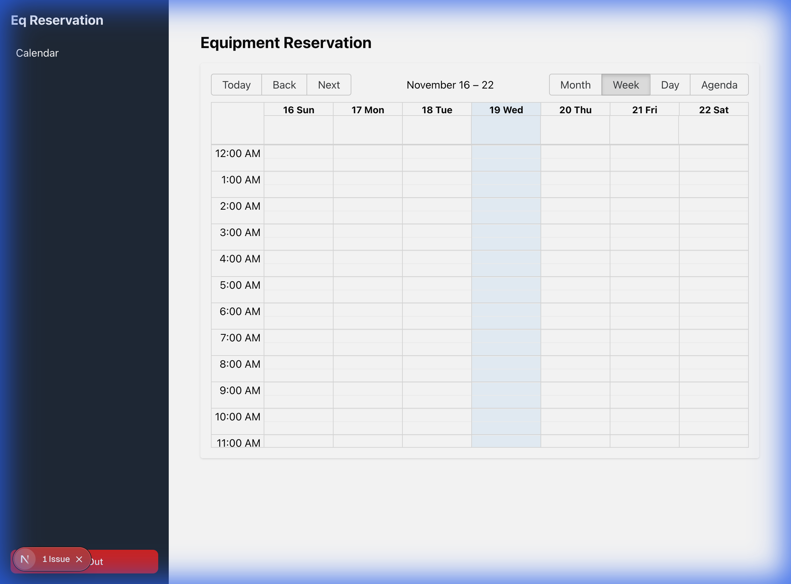
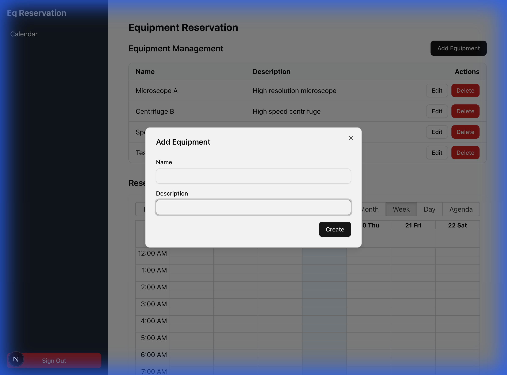
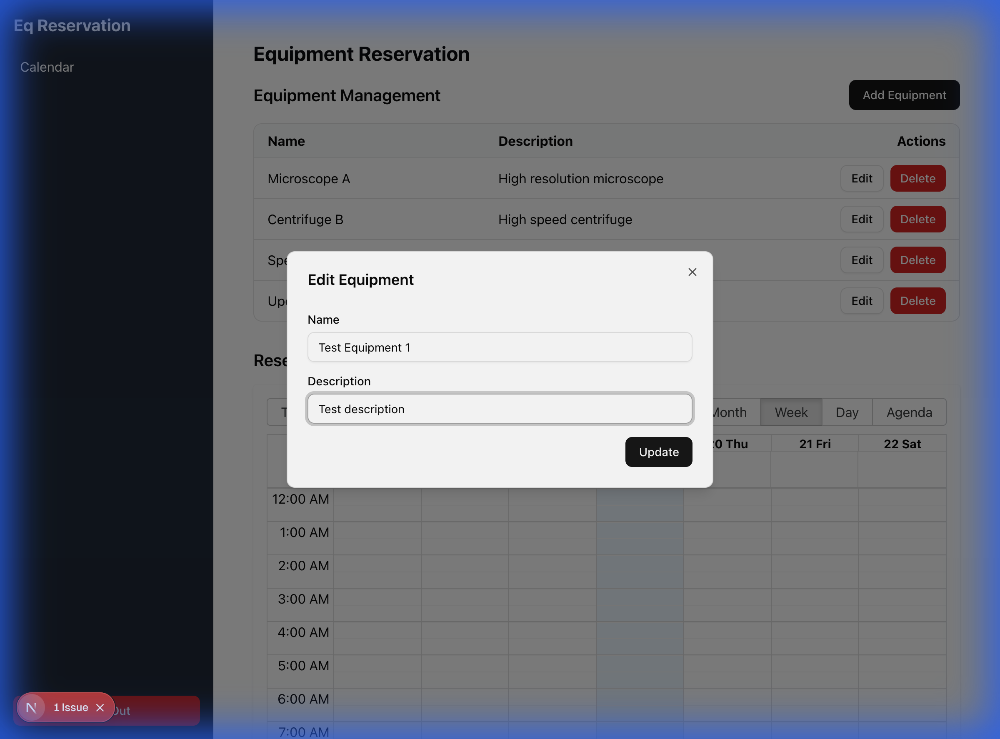
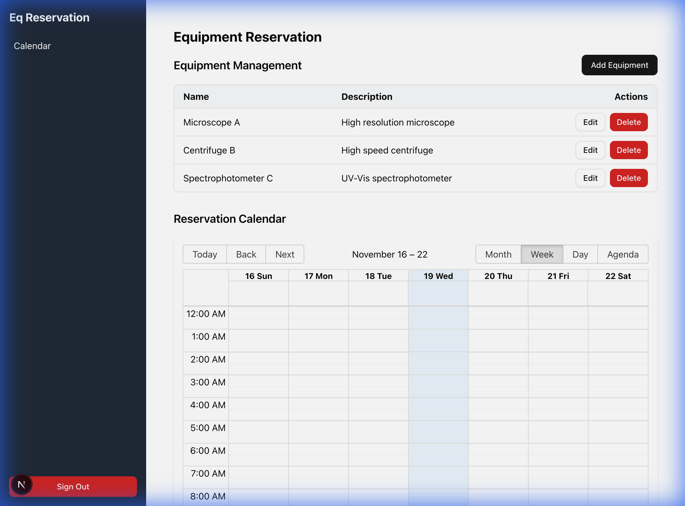

# 認証機能とEquipment CRUD機能の検証

## 概要

Equipment Reservation Systemの認証機能とEquipment CRUD機能を検証し、正常に動作することを確認しました。

---

## 1. 認証機能の検証

### バックエンド認証ロジックの検証

**テストスクリプト**: [src/lib/test-auth.ts](../../src/lib/test-auth.ts)

```bash
npx tsx src/lib/test-auth.ts
```

**結果**: ✅ 成功

- ユーザー検索: 成功
- パスワードハッシュ比較: 成功
- 認証ロジック: 正常動作

### ログインUIの検証

**問題点の発見**

初期状態では、ログインフォームからの認証が失敗していました:

- `authorize`コールバックは正常に実行され、認証は成功
- しかし、`NEXT_REDIRECT`エラーが`src/lib/actions.ts`で誤って処理されていた
- リダイレクトが実行されず、ログインページに留まる

**根本原因**

NextAuth v5のServer Actionsパターンで、`signIn()`が成功すると`NEXT_REDIRECT`をスローしますが、`useActionState`フックはこれをリダイレクトとして処理できませんでした。

### 実施した修正

#### [src/lib/actions.ts](../../src/lib/actions.ts)

`signIn()`呼び出しに`redirectTo`パラメータを追加:

```diff
 await signIn('credentials', {
   email,
   password,
+  redirectTo: '/calendar'
 });
```

この変更により、NextAuthが認証成功後に自動的に`/calendar`ページへリダイレクトするようになりました。

#### [src/auth.ts](../../src/auth.ts)

`authorize`コールバックを適切に実装:

- Zodによる入力検証
- データベースからのユーザー検索
- bcryptjsによるパスワード比較
- 詳細なデバッグログ出力

### 検証結果

**テストケース**: `test@example.com` / `password123`



- URLが`http://localhost:3000/calendar`に遷移
- セッションが正常に確立
- カレンダーページが表示

---

## 2. Equipment CRUD機能の検証

### 実装した機能

Equipment管理UIを新規作成しました:

#### 新規ファイル

- [src/components/equipment/EquipmentManager.tsx](../../src/components/equipment/EquipmentManager.tsx) - Equipment管理コンポーネント
- Server Actions: `createEquipmentAction`, `updateEquipmentAction`

#### 更新したファイル

- [src/app/(dashboard)/calendar/page.tsx](<../../src/app/(dashboard)/calendar/page.tsx>) - Equipment管理UIを統合
- [src/application/actions/equipment.ts](../../src/application/actions/equipment.ts) - Update/Delete actionsを追加

### 検証結果

#### Create Operation ✅

**テストケース**: "Test Equipment 1" / "Test description"



- "Add Equipment"ボタンをクリック
- モーダルフォームに入力
- "Create"ボタンをクリック
- テーブルに新しいEquipmentが表示される

**結果**: ✅ 成功

---

#### Read Operation ✅

Equipment一覧がテーブル形式で表示されることを確認:

- Seed dataからの3つのEquipment
- 新規作成した"Test Equipment 1"
- 各行に名前、説明、アクションボタンが表示

**結果**: ✅ 成功

---

#### Update Operation ✅

**テストケース**: "Test Equipment 1" → "Updated Equipment 1"



- "Edit"ボタンをクリック
- モーダルで名前と説明を変更
- "Update"ボタンをクリック
- テーブルの内容が更新される

**結果**: ✅ 成功

---

#### Delete Operation ✅

**実装内容**:

1. `IEquipmentRepository`に`delete(id: EquipmentId): Promise<Result<void, Error>>`を追加
2. `DrizzleEquipmentRepository`に実装
3. `deleteEquipmentAction`を更新
4. `EquipmentManager`に削除確認ダイアログを実装

**テストケース**: "Test Equipment 1"を削除



- "Delete"ボタンをクリック
- 確認ダイアログが表示
- ダイアログ内の"Delete"ボタンをクリック
- テーブルからEquipmentが削除される

**結果**: ✅ 成功

---

## 技術的な学び

### NextAuth v5 + Server Actions

NextAuth v5でServer Actionsを使用する場合:

- `signIn()`に`redirectTo`パラメータを明示的に指定する
- `useActionState`フックは`NEXT_REDIRECT`を自動的に処理しない
- 認証成功時のリダイレクトはNextAuthに任せる

### Server Actions + useActionState

- Server Actionsは`prevState`パラメータを受け取る必要がある
- 戻り値の型は`initialState`と一致させる
- `revalidatePath()`でページを再検証してUIを更新

### DDD + Repository Pattern

- Domain層でバリデーション（Zod）
- Repository層でデータアクセス
- Application層（Server Actions）で調整
- Result型でエラーハンドリング
